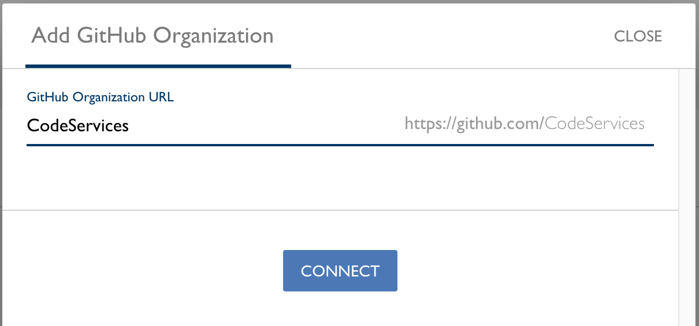
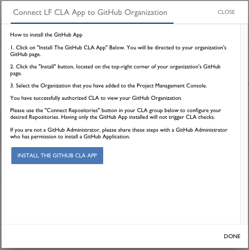

# Install the EasyCLA Application

As a project manager, you use the CLA Management Console to install the EasyCLA Application on GitHub. The EasyCLA Application installation process connects GitHub to the CLA Management Console. After you complete installation, you must [configure the repositories to enforce CLA monitoring](add-github-repositories-to-cla-monitoring-or-remove-them-from-cla-monitoring.md).

**Do these steps:**

1. [Sign in](sign-in-to-the-cla-management-console.md).
2. Click a project of interest.

   The project page appears.

3. Click **CONNECT GITHUB ORGANIZATION**.

   The Add GitHub Organization dialog appears and lets you specify the GitHub organization.

   Connecting your GitHub organization will let you enable EasyCLA checks on that organization. If you already have a CLA process in place, go to [https://cloud.email.thelinuxfoundation.org/EasyCLA](install-the-easycla-application.md) and file a ticket to describe your particular needs, and import your existing CLAs.

   

4. Enter your organization name in the GitHub Organization URL field. The URL automatically appends the name. Click **CONNECT**.

   The Connect LF CLA App to GitHub Organization dialog appears.

   The GitHub organization name value is case-sensitive—make sure that the name you enter matches the case of your GitHub organization name exactly.

5. Read the instructions and click **INSTALL THE GITHUB CLA APP**.

   

   The EasyCLA Application opens in GitHub.

6. Click **Install** on the EasyCLA Application.

   

7. Select one or more repositories and assign permissions. Click **Install**.

   

   The CLA Management Console appears and the GitHub Organizations pane shows the organizations and the repositories that the EasyCLA Application is authorized to monitor.

   **Note:** _To delete an organization from monitoring, click **DELETE** next to the organization that you want to delete. A confirmation dialog appears. Click **DELETE**._

   _You must also_ [_Uninstall LF CLA Application for Your Organization_](uninstall-the-easycla-application.md) _that you installed in Step 5._

   A message informs you that your project needs a CLA group. A CLA group defines one or more CLA types that contributors must sign.

   If the EasyCLA Application is not connected to GitHub properly, an error message appears under the organization name: Not Configured. Please connect the CLA App to the Github Org. Click the **message link** to return to Step 4.

8. Repeat Steps 2 through 7 to connect as many organizations as you want.

**Important:** _To enable a CLA check on a repository, you must configure a GitHub repository or add a Gerrit instance. Simply adding an organization to the project does not enable the CLA check for any CLA groups._

## Next Steps:

* [Add a CLA Group](add-a-cla-group.md)
* [Add GitHub Repositories to CLA Monitoring or Remove Them From CLA Monitoring](add-github-repositories-to-cla-monitoring-or-remove-them-from-cla-monitoring.md)

  or

* [Add Gerrit Instances to CLA Monitoring or Delete Them From CLA Monitoring](add-gerrit-instances-to-cla-monitoring-or-delete-them-from-cla-monitoring.md)

